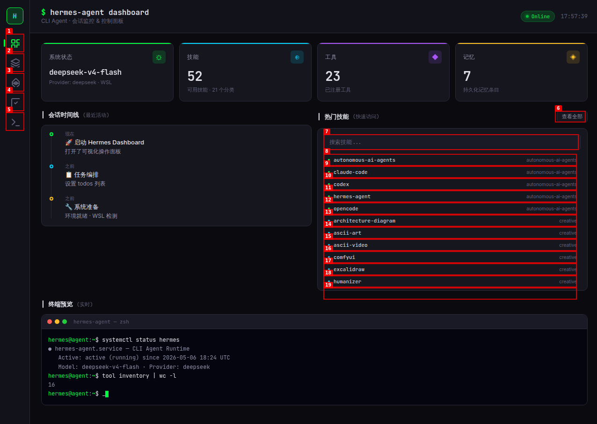

# Hermes Agent Dashboard

> AI Agent Runtime 可视化监控与控制面板

将 Hermes Agent CLI 的运行时状态转化为可视化面板，实时监控 Agent 的技能体系、工具注册表、任务编排和运行状态。

## 功能

- **系统概览** — Agent 运行时模型、Provider 信息、环境状态
- **技能浏览器** — 42 个技能 × 12 个分类，支持搜索和详情查看
- **工具注册表** — 16 个已注册工具，分类展示与一键调用
- **任务管理器** — Todo 待办 + Cron 定时任务面板
- **终端模拟器** — 内嵌交互式终端仿真界面
- **会话时间线** — Agent 操作历史轨迹

## 快速开始

直接在浏览器打开 `hermes-dashboard.html` 即可使用，零配置。

## 技术栈

HTML5 · CSS3 (Dark Theme) · Vanilla JavaScript · WSL2

## 环境

- 运行环境：WSL2 (Windows Subsystem for Linux)
- AI 模型：deepseek-v4-flash
- Agent 框架：Hermes Agent CLI

## 截图

